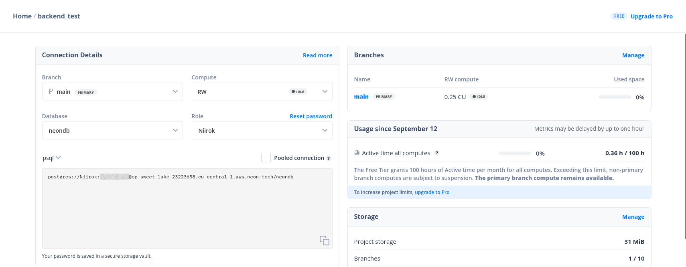

# Mise en prod du Backend de la Todolist

En essayant de mettre en prod le backend de notre application, nous nous sommes rapidement apercu que la technologie de base de données que nous utilisions [n'était pas compatible avec Vercel](https://vercel.com/guides/is-sqlite-supported-in-vercel). Cependant, le même article nous propose rapidement une solution avec un SGBD intégré à Vercel : [Postgresql](https://vercel.com/docs/storage/vercel-postgres), mais c'est alors qu'un autre challenge se profile à l'horizon : Sequelize n'est pas encore supporté par Vercel, ce qui nous indique que l'instalation et l'utilisation de cet ORM sera un peu plus compliquée que prévu. Let's go !

## Configuration nécessaire pour Neon

Avant de commencer à modifier notre code, nous allons dans une premier temps avoir une nouvelle BDD fonctionnant sous Postgresql. Fort heureusement, nous avons déjà par le passé travaillé avec Neon, un SaaS qui héberge des BDD Postgres et nous allons le réutiliser.

Nous pouvons pour cela créer une nouvelle base de données, **se sera votre 1ère tâche**

Une fois faites, vous devriez arriver sur le dashboard suivant :


Sur ce dashboard, vous trouverez le nom d'utilisateur, le mot de passe, le nom de la BDD et son adresse.

Attention cependant, Neon n'autorise que [les connections sécurisées aux BDD](https://neon.tech/docs/connect/connect-securely) que le service héberge. En vous essayant de vous y connecter, vous tomberez rapidement sur une erreur ssl. Il faudra donc trouver une solution pour gérer ce problème lors de la configuration de la connection avec Sequelize (cf Sources).

## Configuration nécessaire pour Sequelize

Ensuite, il faudra modifier la configuration de notre dépot et de notre ORM pour pouvoir entamer notre migration. Dans notre fichier de configuration de Sequelize, nous devons d'abord changer le gestionnaire de base de données de notre service. Ce code devrait être nécessaire pour pouvoir configurer à minima notre base de données. Toutes les informations nécessaires se trouvant sur le dashboard de notre base de données hébergé par Neon.

```typescript
const sequelize = new Sequelize(DB.NAME, DB.USER, DB.USER.PWD, {
  host: DB.ADDR,
  dialect: "postgres", // cf documentation de Sequelize
});
```

C'est aussi à cet endroit qu'il faudra modifier les paramètres _dialectOptions_ pour autoriser la connection SSL à votre BDD.

et il ne faudra pas oublier d'installer les paquets "pg" et "pg-hstore" avec npm pour pouvoir utiliser la BDD, en plus de supprimer le paquet désormais inutile sqlite.

`npm install pg pg-hstore`

## Configuration nécessaire pour Vercel

Vous devriez être assez avancés pour lancer votre serveur et essayer vos premières requêtes sur la BDD. Essayez avec le fichier .http de faire quelques get et post sur le serveur.

Après un commit et un push sur votre dêpot github, vous devriez pouvoir mettre votre projet sur Vercel. Et là, rien ne marche...

Il existe plusieurs raisons à cela, mais c'est principalement dû au manque d'intégration de Node et de ts à Vercel. Il faudra en effet un peu adapter son dépôt en suivant les consignes de [ce post](https://dev.to/tirthpatel/deploy-node-ts-express-typescript-on-vercel-284h).

La seconde erreur se déclare pendant la compilation

### l'erreur "Please install pg package manually"

Cette erreur est assez simple à résoudre. Il s'agit d'un import défectueux dans Vercel du paquet de postgres. [La discussion suivante](https://github.com/orgs/vercel/discussions/234) aide à le résoudre avec un ajout d'une ligne de code. Les explications sur cette erreur se trouve quant à elles sur [cette page](https://vercel.com/guides/why-does-my-serverless-function-work-locally-but-not-when-deployed), cette erreur s'explique principalement par la configuration et l'utilisation de [fonctions serverless](https://vercel.com/docs/functions/serverless-functions) de Vercel.

## La suite : Les variables d'environnement

## Sources

<https://vercel.com/guides/is-sqlite-supported-in-vercel>

<https://vercel.com/docs/storage/vercel-postgres>

<https://neon.tech/docs/connect/connect-securely>

<https://dev.to/tirthpatel/deploy-node-ts-express-typescript-on-vercel-284h>

<https://community.neon.tech/t/how-to-configure-sslmode-in-sequelize/767>

<https://sequelize.org/docs/v6/getting-started/#connecting-to-a-database>

<https://vercel.com/guides/using-express-with-vercel>

<https://github.com/orgs/vercel/discussions/234>

<https://github.com/Niirok/back_todo> à forker pour prendre en exemple back à sable

<https://github.com/Niirok/express-typescript-vercel-part2> idem
